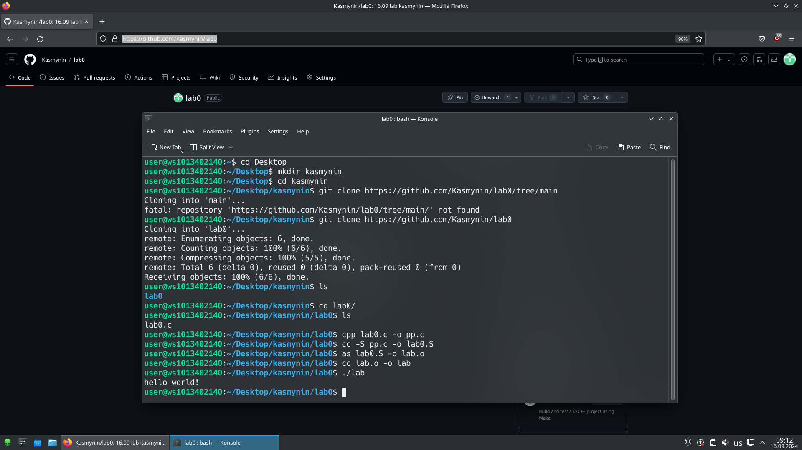

# Лабораторная работа №0
## Задание
Написать программу на С. По отдельности прокомпилировать её
## Проделанная работа 
1. Написан файл "lab0.c":
```c
#include <stdio.h>

int main() {
  printf("hello world!\n");
  return 0;
}
```
2. Препроцессор: "cpp lab0.c -o pp.c"
3. Компилятор: "cc -S pp.c -o lab0.S"
4. Ассемблер: "as lab0.S -o lab.o"
5. Сборщик: "cc lab.o -o lab"
## Скриншот 
 

 
