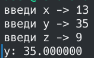
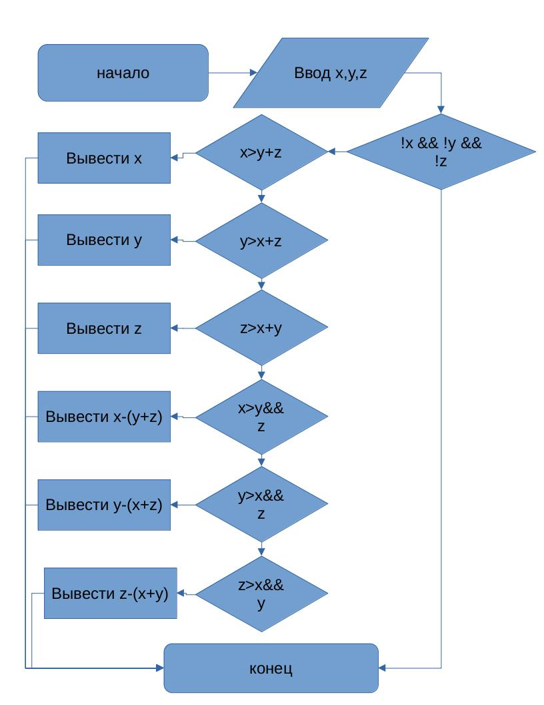

# Лабораторная работа №1

## Вариант 2
Вывести значение наибольшего из трёх параметров x, y, z если оно больше суммы двух других параметров, и разность этой суммы и наибольшего значения иначе.
## Задания
1. разобрать код программы из примера
2. составить блок-схему алгоритма для своего варианта
3. написать программу, решающую задачу по своему варианту
4. оформить отчет
## Screenshot


## Блок-схема


## Программа
```c
#include <stdio.h>

int main()
{
  float x, y, z;
  printf("введи x -> ");
  scanf("%f", &x);
  printf("введи y -> ");
  scanf("%f", &y);
  printf("введи z -> ");
  scanf("%f", &z);
  
  if (!x && !y && !z)
    return 0;

  float max = x;
  if (y > max)
    max = y;
  if (z > max)
    max = z;
  float sum = x + y + z - max;
  if (max > sum)
    printf("max = %f\n", max);
  else
    printf("sum - max = %f\n", sum - max);
  return 0;
}
```
