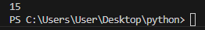

# Лабораторная работа 7
## Задания 
Напишите две функции для решения задач своего варианта - с использованием рекурсии и без.
Оформите отчёт в README.md.
## Решение
### Задание 1
### Вариант 2
Функция для расчёта суммы вложенных списков.
sum_nested([1, [2, [3, 4, [5]]]])
15

#### С рекурсией
```py
def sum_nested(nested_list):
    total = 0
    for item in nested_list:
        if isinstance(item, list):
            total += sum_nested(item)
        elif isinstance(item,(int,float)):
            total += item
        else:
            pass

    return total
print(sum_nested([1, [2, [3, 4, [5]]]]))
```
#### Без рекурсии 
```py
def sum_nested_iterative(nested_list):
    stack = [nested_list]
    total = 0
    while stack:
        current_list = stack.pop()
        for item in current_list:
            if isinstance(item, list):
                stack.append(item)
            elif isinstance(item,(int,float)):
                total += item
            else:
                pass

    return total

print(sum_nested_iterative([1, [2, [3, 4, [5]]]]))
```

вывод один и тот же
### Задание 2
### Вариант 11
Функция для расчёта:

$x_i = \frac{x_{i-1} + 1}{x_{i-1} + 2}$

$x_0 = 1$
#### С рекурсией 
```py
def calculate_x(x, i):
    if i == 0:
        return 1
    else:
        prev_x = calculate_x(x, i-1)
        return (prev_x+1)/(prev_x+2)
x0 = 1 
print("введите i")
i = int(input())
result = calculate_x(x0, i)
print("результат: ", result)
```
#### Без рекурсии
```py
def calculate_x(i):
    x = 1 
    for i in range(1, i):
        x = (x + 1) / (x + 2)
    return x
print("введите i")
i = int(input())
result = calculate_x(i)
print("результат: ", result)
```
