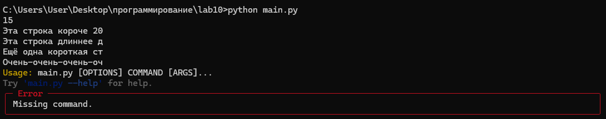

# Лабораторная работа 10
## Задания 
Создайте пакет, содержащий 3 модуля на основе лабораторных работ №№ 7-9
Напишите запускающий модуль на основе Typer, который позволит выбирать и настраивать параметры запуска логики из пакета.
Оформите отчёт в README.md. 
## Решение
### Лабораторная работа 7
```py
def sum_nested_iterative(nested_list):
    stack = [nested_list]
    total = 0
    while stack:
        current_list = stack.pop()
        for item in current_list:
            if isinstance(item, list):
                stack.append(item)
            elif isinstance(item,(int,float)):
                total += item
            else:
                pass

    return total

print(sum_nested_iterative([1, [2, [3, 4, [5]]]]))
```
### Лабораторная работа 8
```py
import requests

def create_api_caller(api_base_url):
    def api_caller(endpoint, params=None):
        url = f"{api_base_url}/{endpoint}"
        try:
            response = requests.get(url, params=params)
            response.raise_for_status()
            data = response.json()
            try:
                return data['data'][0]['attributes']['body']
            except (KeyError, IndexError, TypeError) as e:
                print(f"Ошибка при парсинге ответа: {e}, ответ: {response.text}")
                return None
        except requests.exceptions.RequestException as e:
            print(f"Ошибка запроса к API: {e}")
            return None

    return api_caller


def main():
    api_base_url = "https://dogapi.dog/api/v2"

    get_fact = create_api_caller(api_base_url)

    try:
        fact = get_fact("facts")

        if fact:
            print(f"Факт о собаке: {fact}")
        else:
            print("Не удалось получить факт о собаке.")
    except Exception as e:
        print(f"Ошибка: {e}")


if __name__ == "__main__":
    main()
```
### Лабораторная работа 9
```py
with open("my_file.txt", "w", encoding="utf-8") as f:
    f.write("Эта строка короче 20 символов.\n")
    f.write("Эта строка длиннее двадцати символов и будет усечена.\n")
    f.write("Ещё одна короткая строка.\n")
    f.write("Очень-очень-очень-очень-длинная строка, которая точно будет усечена.\n")

def line_generator(filename, max_length):
    try:
        with open(filename, 'r', encoding="utf-8") as f: 
            for line in f:
                yield line[:max_length] 
    except FileNotFoundError:
        yield "Файл не найден"

for line in line_generator("my_file.txt", 20):
    print(line)
```
## Запускающий модуль на основе Typer
```py
import typer
from lab10.moduls import lab7_10, lab8_10, lab9_10

app = typer.Typer()


@app.command()
def lab7(data: str = typer.Option(help="Data list or tuple")):
    try:
        args = eval(data)
    except (NameError, SyntaxError):
        print("Ошибка: Некорректный ввод")
        return
    print(lab7_10.unpack(args))


@app.command()
def lab8(filename: str = typer.Option(help="Path to file"), max_length: int = typer.Option(20, help="Max length of string")):
    generator = lab8_10.line(max_length)
    for line in generator(filename):
         print(line, end="")

@app.command()
def lab9(n: int = typer.Option(help = "n number")):
    print(lab9_10.f(n))

if __name__ == "__main__":
    app()
```

