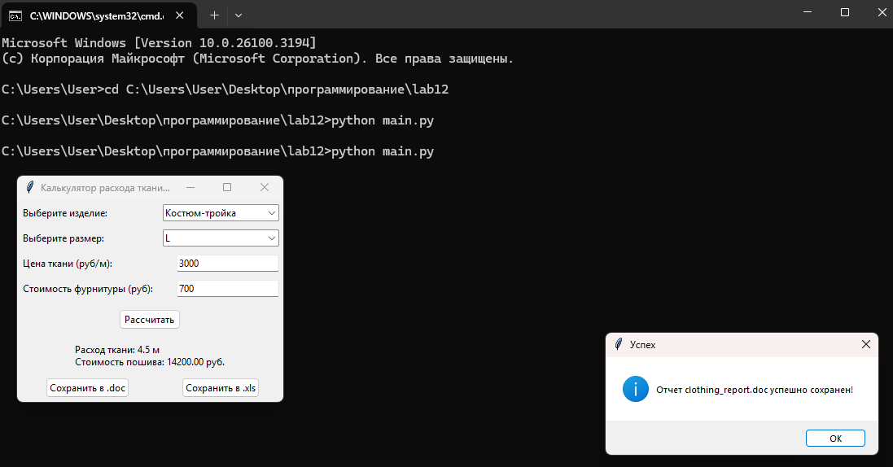
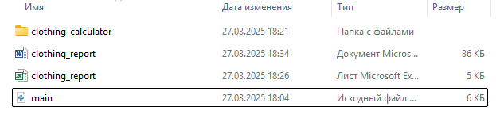

# Лабораторная работа 12
## Задания 
По своему варианту задания и GUI фреймворка создайте пакет, содержащий 3 модуля, и подключите его к основной программе. Основная программа должна предоставлять:

графический пользовательский интерфейс с возможностями ввода требуемых параметров и отображения результатов расчёта,
возможность сохранить результаты в отчёт формата .doc или .xls (например, пакеты python-docx и openpyxl).
### Вариант 10 (tkinker)
Одежда

Пиджак
Брюки
Костюм-тройка
Расчёт расхода ткани в зависимости от размера, расчёт стоимости пошива, учитывая расход ткани и фурнитуры.
## Решение
```py
import tkinter as tk
from tkinter import ttk, messagebox
from clothing_calculator import fabric_calculations, cost_calculations, report_generator
import os

class ClothingCalculatorApp:
    def __init__(self, root):
        self.root = root
        self.root.title("Калькулятор расхода ткани и стоимости пошива")

        # Перечень элементов одежды
        self.item_label = ttk.Label(root, text="Выберите изделие:")
        self.item_label.grid(row=0, column=0, sticky=tk.W, padx=5, pady=5)
        self.item_var = tk.StringVar()
        self.item_combo = ttk.Combobox(root, textvariable=self.item_var, values=["Пиджак", "Брюки", "Костюм-тройка"])
        self.item_combo.grid(row=0, column=1, sticky=tk.E, padx=5, pady=5)

        # Размеры
        self.size_label = ttk.Label(root, text="Выберите размер:")
        self.size_label.grid(row=1, column=0, sticky=tk.W, padx=5, pady=5)
        self.size_var = tk.StringVar()
        self.size_combo = ttk.Combobox(root, textvariable=self.size_var, values=["S", "M", "L", "XL"])
        self.size_combo.grid(row=1, column=1, sticky=tk.E, padx=5, pady=5)

        # Цена ткани
        self.fabric_price_label = ttk.Label(root, text="Цена ткани (руб/м):")
        self.fabric_price_label.grid(row=2, column=0, sticky=tk.W, padx=5, pady=5)
        self.fabric_price_entry = ttk.Entry(root)
        self.fabric_price_entry.grid(row=2, column=1, sticky=tk.E, padx=5, pady=5)

        # Стоимость фурнитуры
        self.accessories_cost_label = ttk.Label(root, text="Стоимость фурнитуры (руб):")
        self.accessories_cost_label.grid(row=3, column=0, sticky=tk.W, padx=5, pady=5)
        self.accessories_cost_entry = ttk.Entry(root)
        self.accessories_cost_entry.grid(row=3, column=1, sticky=tk.E, padx=5, pady=5)

        # Кнопка расчета
        self.calculate_button = ttk.Button(root, text="Рассчитать", command=self.calculate)
        self.calculate_button.grid(row=4, column=0, columnspan=2, pady=10)

        # Результаты
        self.result_label = ttk.Label(root, text="")
        self.result_label.grid(row=5, column=0, columnspan=2, pady=5)

        # Кнопки сохранения отчета
        self.save_doc_button = ttk.Button(root, text="Сохранить в .doc", command=self.save_doc)
        self.save_doc_button.grid(row=6, column=0, pady=5)

        self.save_xls_button = ttk.Button(root, text="Сохранить в .xls", command=self.save_xls)
        self.save_xls_button.grid(row=6, column=1, pady=5)

        self.item = None
        self.size = None
        self.fabric_consumption = None
        self.sewing_cost = None

    def calculate(self):
        try:
            self.item = self.item_var.get()
            self.size = self.size_var.get()
            fabric_price = float(self.fabric_price_entry.get())
            accessories_cost = float(self.accessories_cost_entry.get())

            self.fabric_consumption = fabric_calculations.calculate_fabric_consumption(self.item, self.size)

            if self.fabric_consumption is None:
                 messagebox.showerror("Ошибка", "Некорректные данные!")
                 self.result_label.config(text="")
                 return

            self.sewing_cost = cost_calculations.calculate_sewing_cost(self.fabric_consumption, fabric_price, accessories_cost)
            self.result_label.config(text=f"Расход ткани: {self.fabric_consumption} м\nСтоимость пошива: {self.sewing_cost:.2f} руб.")

        except ValueError:
            messagebox.showerror("Ошибка", "Некорректные числовые значения!")
            self.result_label.config(text="")

    def save_doc(self):
        if self.item == None or self.size == None or self.fabric_consumption == None or self.sewing_cost == None:
             messagebox.showerror("Ошибка", "Рассчитайте, перед тем как сохранить")
             return
        report_generator.generate_doc_report("clothing_report.doc", self.item, self.size, self.fabric_consumption, self.sewing_cost)
        messagebox.showinfo("Успех", "Отчет clothing_report.doc успешно сохранен!")

    def save_xls(self):
        if self.item == None or self.size == None or self.fabric_consumption == None or self.sewing_cost == None:
             messagebox.showerror("Ошибка", "Рассчитайте, перед тем как сохранить")
             return
        report_generator.generate_xls_report("clothing_report.xls", self.item, self.size, self.fabric_consumption, self.sewing_cost)
        messagebox.showinfo("Успех", "Отчет clothing_report.xls успешно сохранен!")

if __name__ == "__main__":
    root = tk.Tk()
    app = ClothingCalculatorApp(root)
    root.mainloop()
```


