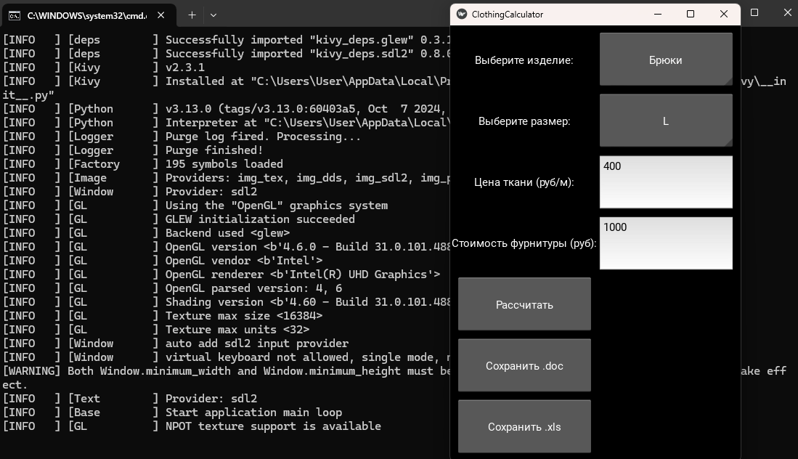
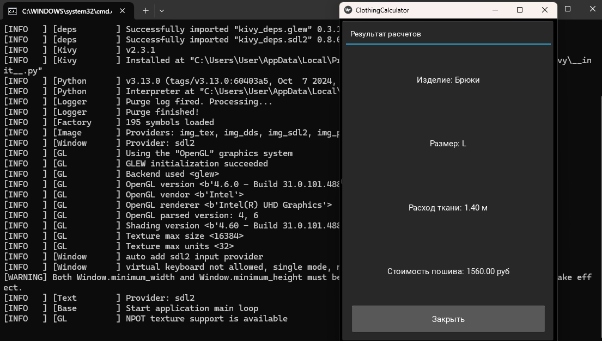
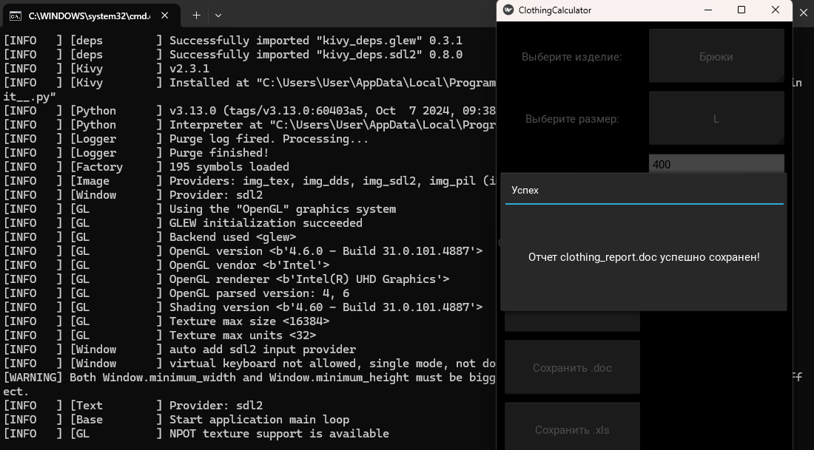
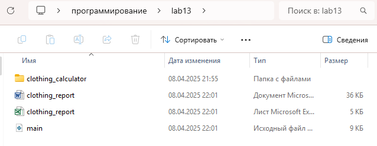

# Лабораторная работа 13
## Задания 
Перепишите свой вариант лабораторной работы №12 с использованием классов и объектов.

Задание то же, вариант GUI фреймворка возьмите следующий по списку.

В коде должны присутствовать:

абстрактный базовый класс и соотвествующие декораторы для методов
иерархия наследования
managed - атрибуты
минимум 2 dunder-метода у подклассов
### Вариант 10 (kivy)
Одежда

Пиджак

Брюки

Костюм-тройка

Расчёт расхода ткани в зависимости от размера, расчёт стоимости пошива, учитывая расход ткани и фурнитуры.
## Решение
```py
import kivy
from kivy.config import Config

# Установка размера окна 
Config.set('graphics', 'width', '400')
Config.set('graphics', 'height', '600')

# Минимальный размер окна
from kivy.core.window import Window
Window.minimum_width = 400
Window.minimum_height = 600

from kivy.app import App
from kivy.uix.boxlayout import BoxLayout
from kivy.uix.gridlayout import GridLayout
from kivy.uix.label import Label
from kivy.uix.spinner import Spinner
from kivy.uix.textinput import TextInput
from kivy.uix.popup import Popup
from kivy.uix.button import Button
from kivy.uix.scrollview import ScrollView
from clothing_calculator.fabric_calculations import JacketFabric, TrousersFabric, SuitFabric
from clothing_calculator.cost_calculations import CostCalculator
from clothing_calculator.report_generator import ReportGenerator

class CalculationResultPopup(Popup):
    def __init__(self, item, size, fabric_consumption, sewing_cost, **kwargs):
        super().__init__(**kwargs)
        self.title = "Результат расчетов"
        content = ScrollView(do_scroll_x=False)
        layout = BoxLayout(orientation='vertical', padding=10, spacing=10)

        layout.add_widget(Label(text=f"Изделие: {item}"))
        layout.add_widget(Label(text=f"Размер: {size}"))
        layout.add_widget(Label(text=f"Расход ткани: {fabric_consumption:.2f} м"))
        layout.add_widget(Label(text=f"Стоимость пошива: {sewing_cost:.2f} руб"))

        button_layout = BoxLayout(orientation='horizontal', size_hint_y=None, height=50)
        close_button = Button(text="Закрыть", on_release=self.dismiss)
        button_layout.add_widget(close_button)
        layout.add_widget(button_layout)

        content.add_widget(layout)
        self.content = content

    def on_dismiss(self):
        pass

class ClothingCalculatorLayout(GridLayout):
    def __init__(self, **kwargs):
        super().__init__(**kwargs)
        self.cols = 2
        self.padding = 10
        self.spacing = 10
        self.fabric_consumption = None
        self.sewing_cost = None
        self.item_selected = None
        self.size_selected = None

        # Spinner для выбора изделия
        self.item_label = Label(text="Выберите изделие:")
        self.add_widget(self.item_label)
        self.item_spinner = Spinner(text="Пиджак", values=("Пиджак", "Брюки", "Костюм-тройка"))
        self.item_spinner.bind(text=self.on_item_selected)
        self.add_widget(self.item_spinner)

        # Spinner для выбора размера
        self.size_label = Label(text="Выберите размер:")
        self.add_widget(self.size_label)
        self.size_spinner = Spinner(text="S", values=("S", "M", "L", "XL"))
        self.size_spinner.bind(text=self.on_size_selected)
        self.add_widget(self.size_spinner)

        # Поле для ввода цены ткани
        self.fabric_price_label = Label(text="Цена ткани (руб/м):")
        self.add_widget(self.fabric_price_label)
        self.fabric_price_input = TextInput(multiline=False)
        self.add_widget(self.fabric_price_input)

        # Поле для ввода стоимости фурнитуры
        self.accessories_cost_label = Label(text="Стоимость фурнитуры (руб):")
        self.add_widget(self.accessories_cost_label)
        self.accessories_cost_input = TextInput(multiline=False)
        self.add_widget(self.accessories_cost_input)

        # Кнопка расчета
        self.calculate_button = Button(text="Рассчитать", on_release=self.calculate)
        self.add_widget(self.calculate_button)
        self.add_widget(Label())  # Пустой виджет для выравнивания

        # Кнопка сохранения отчета (doc)
        self.save_doc_button = Button(text="Сохранить .doc", on_release=self.save_doc)
        self.add_widget(self.save_doc_button)
        self.add_widget(Label())  # Пустой виджет для выравнивания

        # Кнопка сохранения отчета (xls)
        self.save_xls_button = Button(text="Сохранить .xls", on_release=self.save_xls)
        self.add_widget(self.save_xls_button)
        self.add_widget(Label())  # Пустой виджет для выравнивания

    def on_item_selected(self, spinner, text):
        self.item_selected = text

    def on_size_selected(self, spinner, text):
        self.size_selected = text

    def calculate(self, instance):
        try:
            fabric_price = float(self.fabric_price_input.text)
            accessories_cost = float(self.accessories_cost_input.text)

            if self.item_selected == "Пиджак":
                fabric_calculator = JacketFabric()
            elif self.item_selected == "Брюки":
                fabric_calculator = TrousersFabric()
            elif self.item_selected == "Костюм-тройка":
                fabric_calculator = SuitFabric()
            else:
                raise ValueError("Не выбран тип изделия")

            if self.size_selected is None:
                raise ValueError("Не выбран размер")

            self.fabric_consumption = fabric_calculator.calculate_fabric_consumption(self.size_selected)
            if self.fabric_consumption is None:
                 raise ValueError("Некорректный размер для данного изделия")

            cost_calculator = CostCalculator()
            self.sewing_cost = cost_calculator.calculate_sewing_cost(self.fabric_consumption, fabric_price, accessories_cost)

            popup = CalculationResultPopup(
                item=self.item_selected,
                size=self.size_selected,
                fabric_consumption=self.fabric_consumption,
                sewing_cost=self.sewing_cost,
            )
            popup.open()

        except ValueError as e:
            messagebox = Popup(
                title="Ошибка",
                content=Label(text=str(e)),
                size_hint=(None, None),
                size=(400, 200)
            )
            messagebox.open()

    def save_doc(self, instance):
        if self.fabric_consumption is None or self.sewing_cost is None:
            messagebox = Popup(
                title="Ошибка",
                content=Label(text="Сначала выполните расчет!"),
                size_hint=(None, None),
                size=(400, 200)
            )
            messagebox.open()
            return
        report_generator = ReportGenerator()
        report_generator.generate_doc_report("clothing_report.doc", self.item_selected, self.size_selected, self.fabric_consumption, self.sewing_cost)
        messagebox = Popup(
                title="Успех",
                content=Label(text="Отчет clothing_report.doc успешно сохранен!"),
                size_hint=(None, None),
                size=(400, 200)
            )
        messagebox.open()

    def save_xls(self, instance):
        if self.fabric_consumption is None or self.sewing_cost is None:
            messagebox = Popup(
                title="Ошибка",
                content=Label(text="Сначала выполните расчет!"),
                size_hint=(None, None),
                size=(400, 200)
            )
            messagebox.open()
            return
        report_generator = ReportGenerator()
        report_generator.generate_xls_report("clothing_report.xls", self.item_selected, self.size_selected, self.fabric_consumption, self.sewing_cost)
        messagebox = Popup(
                title="Успех",
                content=Label(text="Отчет clothing_report.xls успешно сохранен!"),
                size_hint=(None, None),
                size=(400, 200)
            )
        messagebox.open()

class ClothingCalculatorApp(App):
    def build(self):
        return ClothingCalculatorLayout()

if __name__ == "__main__":
    ClothingCalculatorApp().run()
```







