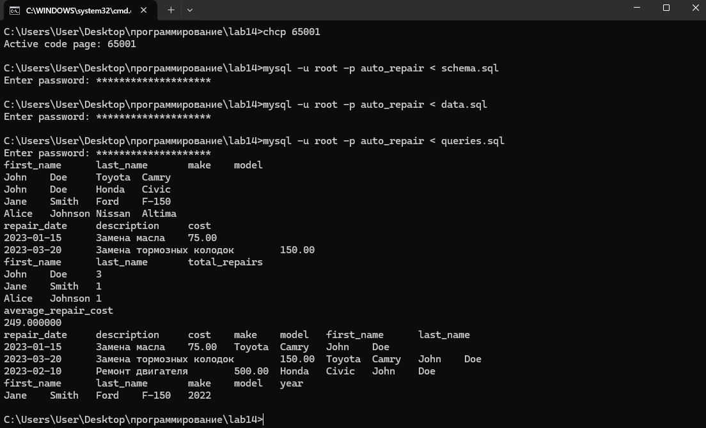

# Лабораторная работа 14
## Задания 
Спроектируйте БД с использованием crow’s foot notation.
Создайте таблицы БД и заполните данными. Для генерации данных можно использовать сервис https://www.mockaroo.com/.
Напишите несколько запросов для выборки данных из всех таблиц.
## Решение

