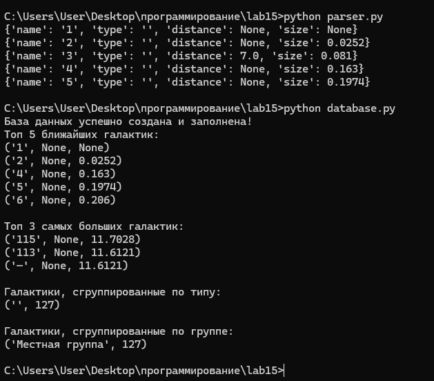

# Лабораторная работа 15
## Задания 
Спроектируйте БД с использованием crow’s foot notation.

Реализуйте парсер для сбора данных с веб-страницы.

С помощью DB API cоздайте таблицы БД и заполните их данными, полученными с помощью парсера.

Напишите запросы для выборки данных из БД.

## Вариант 10
Список ближайших галактик

Таблицы:

галактика
тип
группа

Запросы:

топ N близких/далёких галактик
топ N больших/маленьких галактик
галактики с группировкой по типу
галактики с группировкой по группе
## Результат (это лучшее что я смог)

