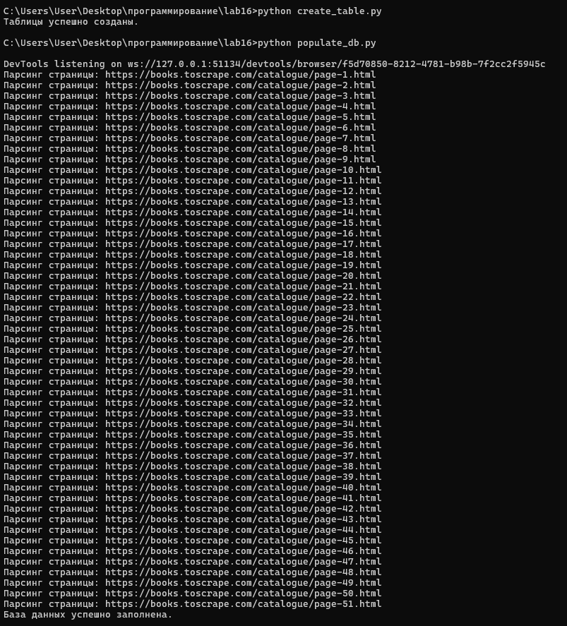
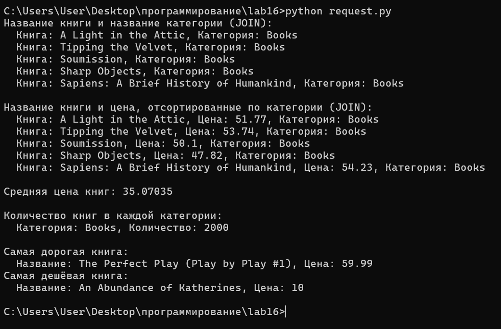

# Лабораторная работа 16
## Задания 
Реализуйте парсер с использованием Selenium для сбора данных с веб-страницы. Это может быть:

онлайн-каталог
интернет-магазин
энциклопедия и т.д.
Основное требование: чтобы ресурсы не повторялись внутри группы, т.е. все должны парсить разные сайты.

Создайте таблицы БД и заполните их данными, полученными с помощью парсера. У вас должно быть минимум 2 таблицы. При заполнении в запросах используйте именованные плейсхолдеры драйвера вашей СУБД.
Напишите запросы для выборки данных из БД с использованием PyPika Query Builder. У вас должно быть:

2 запроса с JOIN
3 запроса с расчётом статистики/группировкой/агрегирующими функциями

## сайт https://books.toscrape.com (для учебы парсинга)
Запросы:

топ N близких/далёких галактик
топ N больших/маленьких галактик
галактики с группировкой по типу
галактики с группировкой по группе
## Результат

