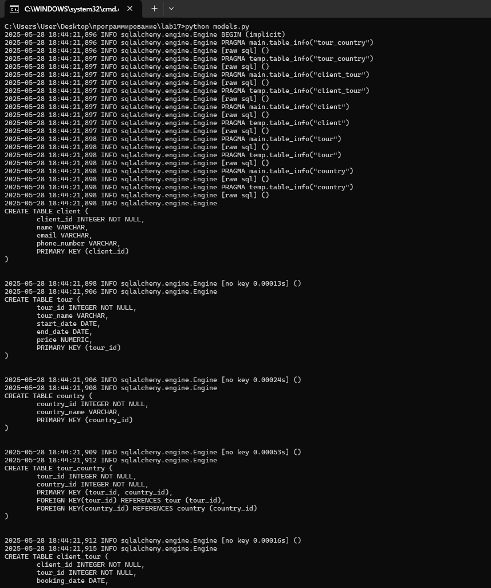

# Лабораторная работа 17
## Задания 
Спроектируйте БД с использованием crow’s foot notation.

Напишите модели данных, создайте и заполните БД с помощью SQLAlchemy.

Напишите запросы для выборки и анализа данных из БД.

## Вариант 10: Туристическое агенство. Продаёт своим клиентам туры в разные страны. Каждый клиент может посетить одну или несколько стран в рамках тура.
Запросы:

1. Найдите всех клиентов

2. Найдите все туры во Францию

3. Найдите всех клиентов, которые забронировали тур "Итальянское приключение"

4. Найдите туры стоимостью более 1500 долларов

5. Исправлен запрос количества туров на одного клиента

## Результат

