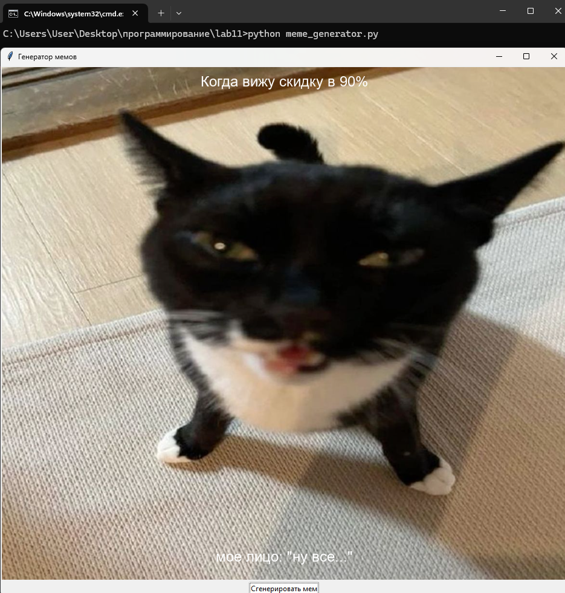

# Лабораторная работа 11
## Задания 
Реализуйте приложение с GUI (приложения-игры допускается делать с использованием TUI-пакетов) по своему варианту. Можно изменить задание на собственную тему, согласовав с преподавателем.
Оформите README.md. 
### Вариант 2
Генератор мемов.
## Решение
```py
import tkinter as tk
from tkinter import ttk
from PIL import Image, ImageTk, ImageDraw, ImageFont
import random
import os

class MemeGeneratorApp:
    def __init__(self, root):
        self.root = root
        self.root.title("Генератор мемов")

        self.images_dir = "images"
        self.top_texts_file = "top_texts.txt"
        self.bottom_texts_file = "bottom_texts.txt"

        self.images = self.load_images()
        self.top_texts = self.load_texts(self.top_texts_file)
        self.bottom_texts = self.load_texts(self.bottom_texts_file)

        self.current_image = None
        self.image_label = ttk.Label(root)
        self.image_label.pack()

        self.generate_button = ttk.Button(root, text="Сгенерировать мем", command=self.generate_meme)
        self.generate_button.pack()

        self.font = ImageFont.truetype("arial.ttf", 24)

        self.generate_meme()

    def load_images(self):
        image_files = [f for f in os.listdir(self.images_dir) if f.lower().endswith((".jpg", ".jpeg", ".png"))]
        return [os.path.join(self.images_dir, f) for f in image_files]

    def load_texts(self, filename):
        try:
            with open(filename, "r", encoding="utf-8") as f:
                return [line.strip() for line in f]
        except FileNotFoundError:
            return ["Текст не найден"]
        
    def generate_meme(self):
         # Clear previous image
        if self.current_image:
            self.image_label.config(image="")
            self.current_image = None

        if not self.images or not self.top_texts or not self.bottom_texts:
             self.image_label.config(text="Недостаточно данных для генерации мема.")
             return

        image_path = random.choice(self.images)
        top_text = random.choice(self.top_texts)
        bottom_text = random.choice(self.bottom_texts)

        meme_image = self.create_meme_image(image_path, top_text, bottom_text)
        if meme_image:
            self.current_image = ImageTk.PhotoImage(meme_image)
            self.image_label.config(image=self.current_image)

    def create_meme_image(self, image_path, top_text, bottom_text):
        try:
             image = Image.open(image_path)
             draw = ImageDraw.Draw(image)
             width, height = image.size
           
             bbox_top = draw.textbbox((0, 0), top_text, font=self.font)
             text_width_top = bbox_top[2] - bbox_top[0]
             text_height_top = bbox_top[3] - bbox_top[1]
             x = (width - text_width_top) / 2 
             y = 10
             draw.text((x, y), top_text, fill=(255, 255, 255), font=self.font)

             bbox_bottom = draw.textbbox((0, 0), bottom_text, font=self.font)
             text_width_bottom = bbox_bottom[2] - bbox_bottom[0]
             text_height_bottom = bbox_bottom[3] - bbox_bottom[1]
             x = (width - text_width_bottom) / 2
             y = height - text_height_bottom - 30  
             draw.text((x, y), bottom_text, fill=(255, 255, 255), font=self.font)

             return image
        except Exception as e:
             print(f"Ошибка при создании мема: {e}")
             return None

if __name__ == "__main__":
    root = tk.Tk()
    app = MemeGeneratorApp(root)
    root.mainloop()
```

