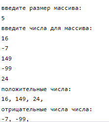

# Лабораторная работа 3

## Вариант 2
Максимально эффективно по используемой памяти записать отрицательные и положительные элементы массива в массивы P и N соответственно.
## Задания
1. Выполнить задание
2. Составить отчет
3. Сделать скриншот результата
## Скриншот

## Программа 
``` c
#include <stdio.h>
#include <stdlib.h>

int main() {
  printf("введите размер массива: \n");
  int n;
  scanf("%d", &n);
  printf("введите числа для массива: \n");

  int *A = (int *)malloc(n * sizeof(int));
  for (int i = 0; i < n; i++) {
    scanf("%d", &A[i]);
}
  int *P = (int *)malloc(n * sizeof(int));
  int *N = (int *)malloc(n * sizeof(int));
  int pi = 0, ni = 0;

  for (int i = 0; i < n; i++) {
    if (A[i] >= 0) {
      P[pi++] = A[i];
    } else {
      N[ni++] = A[i];
    }
  }

  printf("положительные числа: \n");
  for (int i = 0; i < pi; i++) {
    printf("%d, " , P[i]);
  }
  printf ("\n");

  printf("отрицательные числа числа: \n");
    for (int i = 0; i < ni; i++) {
      printf("%d, " , N[i]);
    }
    printf ("\n");

  free(A);
  free(P);
  free(N);

  return 0;
}
```
