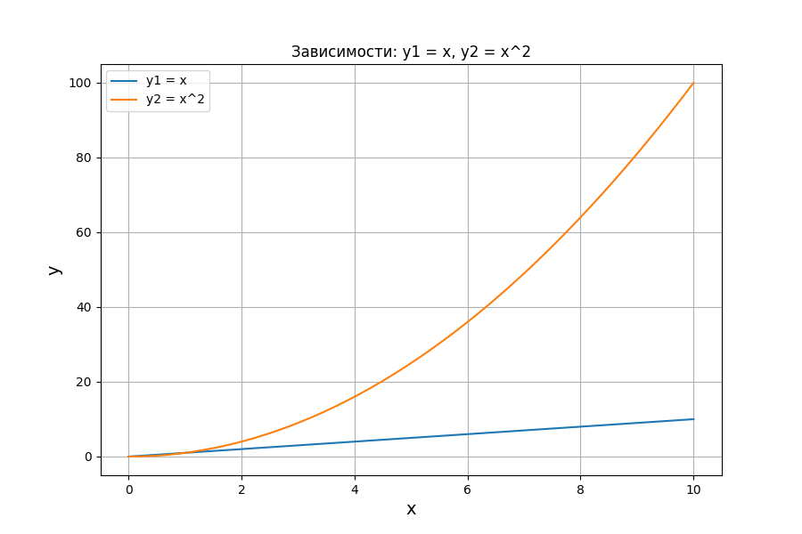
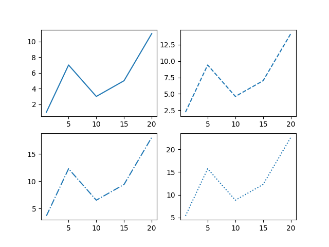
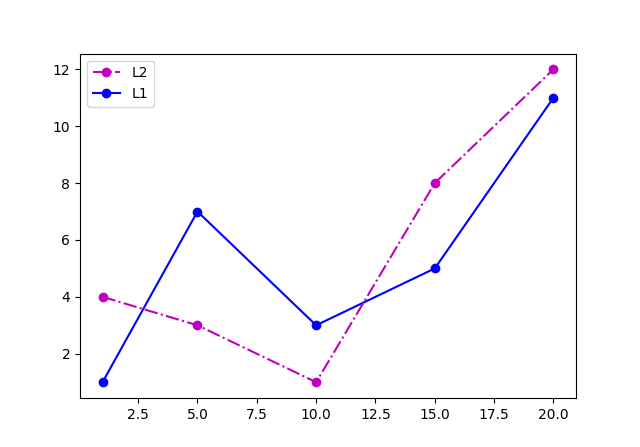
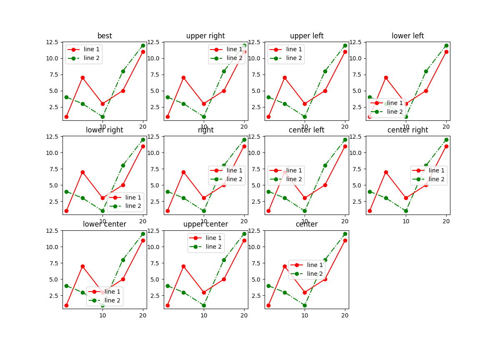
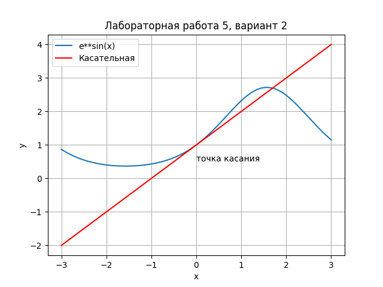

# Лабораторная работа 5

## Вариант 2
## Задания
1) Создайте в каталоге для данной ЛР в своём репозитории виртуальное окружение и установите в него matplotlib и numpy. Создайте файл requirements.txt.
2) Откройте книгу [1] и выполните уроки 1-3. Первый урок можно начинать со стр. 8.
3) Выберите одну из неразрывных функции своего варианта из лабораторной работы №2, постройте график этой функции и касательную к ней. Добавьте на график заголовок, подписи осей, легенду, сетку, а также аннотацию к точке касания.
4) Добавьте в корень своего репозитория файл .gitignore отсюда, перед тем как делать очередной коммит.
5) Оформите отчёт в README.md. Отчёт должен содержать:
графики, построенные во время выполнения уроков из книги
объяснения процесса решения и график по заданию 4
Склонируйте этот репозиторий НЕ в ваш репозиторий, а рядом. Изучите использование этого инструмента и создайте pdf-версию своего отчёта из README.md. Добавьте её в репозиторий.
## Уроки
### урок 1

### урок 2

### урок 3


## График (2 вариант)
$f(x)=e^{sinx}$
```py
import numpy as np
import matplotlib.pyplot as plt
from math import *

# задал верхнюю часть функции из варианта 3
def f(x):
    return e**sin(x)

# создал список точек от -3 до 3 (1000 точек)
x = np.linspace(-3, 3, 1000)
# список точек функции из варианта
y1 = [f(i) for i in x]
# касательная в точке 0  (исправлено!)
y2 = x + 1

# заголовок
plt.title('Лабораторная работа 5, вариант 2')
# название осей
plt.xlabel('x')
plt.ylabel('y')
# включение сетки
plt.grid()
# построение этих функций
plt.plot(x, y1, label='e**sin(x)')
plt.plot(x, y2, 'r', label='Касательная')
# аннотация
plt.text(0, 0.5, 'точка касания') #Приблизительно
# легенда
plt.legend()
# вывести график
plt.show()
```

