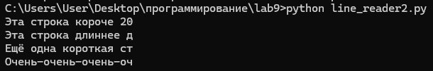

# Лабораторная работа 9
## Задания 
Решите задачу своего варианта.
Оформите отчёт в README.md.
### Вариант 2
Генератор для построчного чтения файла. Если длина строки превышает заданный предел - возвращает подстроку допустимого размера.
## Решение
```py
def line_generator(filename, max_length):
    try:
        with open(filename, 'r') as f:
            for line in f:
                yield line[:max_length]
    except FileNotFoundError:
        yield "Файл не найден"

for line in line_generator("my_file.txt", 20):
    print(line)
```
немного переделал для конкреного примера
```py
with open("my_file.txt", "w", encoding="utf-8") as f:
    f.write("Эта строка короче 20 символов.\n")
    f.write("Эта строка длиннее двадцати символов и будет усечена.\n")
    f.write("Ещё одна короткая строка.\n")
    f.write("Очень-очень-очень-очень-длинная строка, которая точно будет усечена.\n")

def line_generator(filename, max_length):
    try:
        with open(filename, 'r', encoding="utf-8") as f: 
            for line in f:
                yield line[:max_length]
    except FileNotFoundError:
        yield "Файл не найден"

for line in line_generator("my_file.txt", 20):
    print(line)
```

